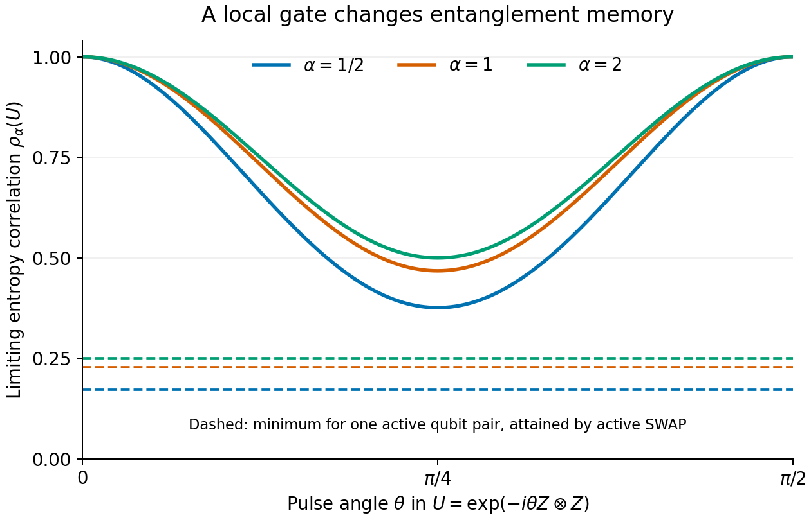

# Gate Entanglement Covariance

Entanglement covariance of Haar-random states under fixed boundary gates, with operator Schmidt formulas, proofs, and reproducible calculations.

**How much of a state's entanglement fluctuation survives a gate acting across a small boundary?**

Take a random pure state of two large quantum systems. Apply a fixed gate to a small part of each system, then compare the entanglement before and after the gate. Averaging over Haar-random input states gives the same mean entropy at both times. The question is whether a state that starts above the mean tends to remain above it.

The central result relates that correlation to the gate's **operator Schmidt spectrum**. For balanced growing systems and fixed boundary access, this spectrum determines the limiting covariance of every fixed positive-order Rényi entropy, including von Neumann entropy and pure-state logarithmic negativity.

Three consequences make the relation useful:

- A gate with fixed spatial access leaves a positive limiting same-order entropy correlation. For a boundary qubit pair, the minimum Rényi-2 correlation is **1/4**.
- Gates with the same operator purity can retain different correlations at other entropy orders.
- An ideal hierarchy of integer-order entropy covariances identifies the operator Schmidt probabilities, although its poor conditioning limits practical reconstruction.

The absolute entropy fluctuations shrink as the half-dimension grows. The theorem concerns their rescaled covariance. Its input ensemble is complex Haar; the tested Floquet-eigenstate extension did not follow the same law.



The curves are analytical large-d predictions for a boundary ZZ gate. Horizontal lines give the minima attained by an active-qubit SWAP. [Understand this example](docs/WORKED_EXAMPLE.md), or [regenerate the figure](REPRODUCE.md).

## Read the story

**One background tutorial:** James A. Mingo and Roland Speicher,
*Free Probability and Random Matrices* (2017). The [selected passages and reading
map](docs/START_HERE.md#selected-reading) use the verified author PDF, not
published-book page numbers. The repository supplies the quantum-information
dictionary and the gate-dependent argument. Primary research sources remain
credited proof inputs, not additional prerequisite tutorials.

| Route | Where to go |
|---|---|
| **LEARN** | [Physical setup and selected reading](docs/START_HERE.md) → [book-to-project bridge](docs/TUTORIAL_BRIDGE.md) → [complete gate calculation](docs/WORKED_EXAMPLE.md) → [results and evidence](docs/RESULTS.md) |
| **CHECK** | Read [the theorem](theory/THEOREM.md), [proof](theory/PROOF.md), [scope and claims](docs/SCOPE.md), [references](docs/REFERENCES.md), and [evidence](docs/RESULTS.md). |
| **REPRODUCE** | Run the [focused commands](REPRODUCE.md) to check the formula implementation and reference data and regenerate the analytical figure. |

## Run the focused reproduction

Use Python 3.12:

```sh
python -m pip install -r requirements.txt
python scripts/reproduce.py
```

The command checks the maintained calculations against saved exact results, verifies the scientific reference files, runs six deterministic checks, and generates the reader figure and table under `build/reproduction/`. Reference data and study implementations are checked by SHA-256 before and after the run. [Reproduction details](REPRODUCE.md) distinguish this default calculation from optional sampling and figure scripts.

The [repository map](docs/REPOSITORY_MAP.md) locates supporting derivations, study data and implementations. For AI-assisted retrieval, [llms.txt](llms.txt) maps research questions to the relevant sources.

## Purpose and contact

This repository serves as a record of the work and a guide for the author’s self-directed learning. For discussion or potential collaboration, please contact Ruge Lin at [gogoko699@gmail.com](mailto:gogoko699@gmail.com).

## License and citation

The original code, documentation, figures and accompanying data in this repository are available under the [MIT License](LICENSE), copyright 2026 Ruge Lin. External publications and separately installed dependencies retain their own licenses; the [references](docs/REFERENCES.md) credit the scientific sources.

To cite this work, use [CITATION.cff](CITATION.cff) and identify the commit used for your calculations. Scientific attribution and the license terms are separate: the citation request adds no condition to the MIT License.
