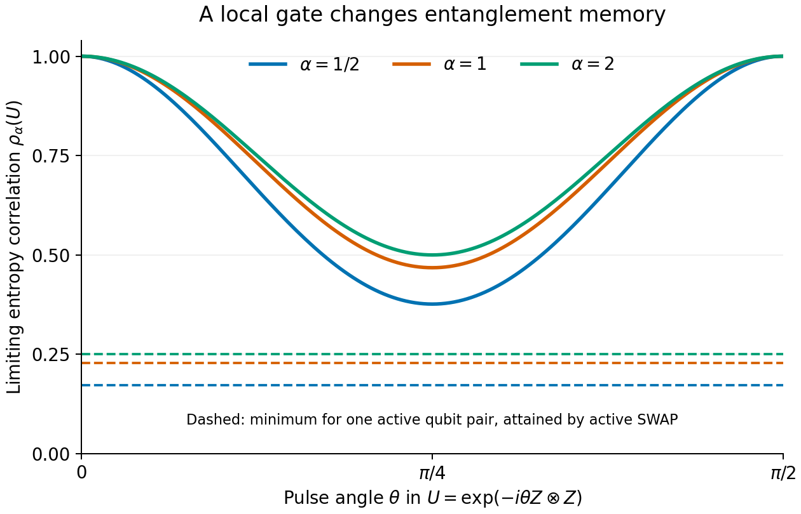

# One boundary qubit pair

This example compares three fixed two-qubit gates inside two growing halves. It evaluates the covariance theorem directly; it adds no random-state simulation. The tutorial bridge explains the [state-to-matrix dictionary](TUTORIAL_BRIDGE.md#2-a-quantum-state-becomes-a-normalized-wishart-matrix) and the [common trace normalization](TUTORIAL_BRIDGE.md#5-normalization-turns-spectral-modes-into-entropy-fluctuations). Readers who know those conventions can start here.

Write

```math
A=aR,\qquad B=bT,\qquad
\dim a=\dim b=2,\qquad
\dim R=\dim T=n,\qquad d=2n.
```

For every complex-Haar input $\psi$, compare the entropy across $aR\mid bT$ before and after a gate on $ab$, using the same input for both observations. Keep that gate fixed while $n$ grows. If each half has $m$ qubits, $d=2^m$ and $n=2^{m-1}$; the total system has $2m$ qubits. The three choices are the identity, a $ZZ$ phase gate, and SWAP of the active qubits. All entropies use natural logarithms.

## The three gate spectra

Here $I$ is the two-dimensional identity and the Pauli matrices are

```math
X=\begin{pmatrix}0&1\\1&0\end{pmatrix},\qquad
Y=\begin{pmatrix}0&-i\\i&0\end{pmatrix},\qquad
Z=\begin{pmatrix}1&0\\0&-1\end{pmatrix}.
```

They obey $\operatorname{Tr}(P^\dagger Q)=2\delta_{PQ}$ for $P,Q\in\{I,X,Y,Z\}$. Thus $P/\sqrt2$ form an orthonormal operator basis. Every two-qubit unitary has Hilbert-Schmidt norm $\sqrt{\operatorname{Tr}(U^\dagger U)}=2$. The operator Schmidt probabilities $\eta_h$ are its squared Schmidt coefficients divided by $4$. They describe the **gate**, not the input state's reduced-state eigenvalues.

**Identity.** The gate is one product operator. Its normalized operator Schmidt spectrum is $(1)$, hence $F_k=1$. Every state's entropy is unchanged.

**The phase gate.** Since $(Z\otimes Z)^2=I$,

```math
U_{ZZ}=e^{-i\pi Z\otimes Z/4}
=\frac{I\otimes I-iZ\otimes Z}{\sqrt2}.
```

In the orthonormal operator bases above, both coefficient magnitudes are $\sqrt2$. Squaring and dividing by $4$ gives probabilities $(1/2,1/2)$, so $F_k=2^{1-k}$.

**The active SWAP.** Its Pauli expansion is

```math
P_{ab}=\frac12\left(I\otimes I+X\otimes X
+Y\otimes Y+Z\otimes Z\right).
```

The four coefficient magnitudes in those bases are all $1$, giving probabilities $(1/4,1/4,1/4,1/4)$ and $F_k=4^{1-k}$. This is the flattest possible operator Schmidt spectrum for a two-qubit gate. Only $a$ and $b$ are swapped; the spectators remain in place. [Why this differs from swapping the entire halves](#why-swap-can-change-this-entanglement) is essential to the example.

## The simplest entropy calculation

For reduced-state probabilities $\lambda_j$, $S_2=-\log\sum_j\lambda_j^2$. At this order the coefficient sequence in the [theorem](../theory/THEOREM.md) has only one nonzero term: $c_{2,2}=-1$. Consequently,

```math
\lim_{d\to\infty}d^2\operatorname{Var}[S_2(\psi)]=\frac12,
\qquad
\lim_{d\to\infty}d^2\operatorname{Cov}[S_2(U\psi),S_2(\psi)]
=\frac12F_2(U).
```

Thus the rescaled covariance, denoted $K_2(U)$ here, equals $F_2(U)/2$. The two entropies have identical variances by Haar invariance. Their limiting correlation $\rho_2(U)$ is therefore $F_2(U)$. Their mean-square difference is twice the variance minus twice the covariance:

```math
D_2(U):=\lim_{d\to\infty}d^2\mathbb E
\left[(S_2(U\psi)-S_2(\psi))^2\right]=1-F_2(U).
```

The complete calculation is therefore:

| Gate on $ab$ | Nonzero $\eta_h$ | $F_2=\sum_h\eta_h^2$ | Rescaled covariance $K_2$ | Correlation $\rho_2$ | Rescaled increment $D_2$ |
|---|---|---:|---:|---:|---:|
| Identity | $(1)$ | $1$ | $1/2$ | $1$ | $0$ |
| $e^{-i\pi ZZ/4}$ | $(1/2,1/2)$ | $1/2$ | $1/4$ | $1/2$ | $1/2$ |
| Active SWAP | $(1/4,1/4,1/4,1/4)$ | $1/4$ | $1/8$ | $1/4$ | $3/4$ |

The mean entropy change is zero for all three gates. The table describes how much the paired fluctuations change. For example, an active SWAP gives an asymptotic root-mean-square $S_2$ change of $\sqrt{3}/(2d)$, which vanishes as the half-dimension grows.

The gate spectra and their power sums are exact. For identity, the correlation $1$ and zero increment are exact at every nontrivial half-dimension. All displayed rescaled covariance values, including identity's $1/2$, are asymptotic; the other gates' entropy correlations and increments are also limits. An exact finite-dimensional purity correlation must not be substituted for a Rényi-2 entropy correlation: taking logarithms changes the observable.

## Changing the entropy order

For a general fixed order $\alpha>0$, define the limiting same-order correlation by

```math
\rho_\alpha(U)=
\frac{\sum_{k\geq2}k c_{\alpha,k}^2F_k(U)}
{\sum_{k\geq2}k c_{\alpha,k}^2}.
```

Here are deterministic evaluations of that convergent series, rounded to six decimal places:

| Gate | Logarithmic negativity, $\alpha=1/2$ | Von Neumann, $\alpha=1$ | Rényi-2, $\alpha=2$ |
|---|---:|---:|---:|
| Identity | 1 | 1 | 1 |
| $e^{-i\pi ZZ/4}$ | 0.376423 | 0.467936 | 0.5 |
| Active SWAP | 0.172322 | 0.227732 | 0.25 |

Unlike order two, the first two columns include higher $F_k$. They therefore weight the same gate spectrum differently. These decimals are theorem evaluations, not fitted correlations or uncertainty estimates. The [saved reader calculation](../results/reader_examples.json) uses modes $2\leq k\leq65536$ and records a cutoff-doubling diagnostic. That diagnostic checks numerical series convergence; it is not a rigorous remainder bound or a finite-size error estimate. The order-two series terminates exactly.

The active SWAP attains the lower bound in each column. Any gate on the same two active qubits has at most four nonzero operator Schmidt probabilities, and convexity gives $F_k\geq4^{1-k}$. Every coefficient weight $k c_{\alpha,k}^2$ in the same-order correlation is nonnegative.

### The existing analytical figure



Solid curves show $\rho_\alpha(e^{-i\theta ZZ})$ for $\alpha=1/2,1,2$, using the exact gate probabilities $(\cos^2\theta,\sin^2\theta)$ at 161 angles from $0$ to $\pi/2$. Each is a covariance divided by its gate-independent marginal variance, not an entropy or an unscaled covariance. The dashed horizontal lines show the corresponding active-SWAP values, attained by the flat four-probability spectrum. Both endpoints of each solid curve have correlation $1$: at $\theta=\pi/2$ the gate is $-iZ\otimes Z$, a product of local operators, and every state's entanglement is unchanged.

The figure evaluates the large-$d$ series with cutoff $65536$ through [the maintained plotting function](../gate_covariance/plotting.py). It uses no fitted parameters or random states. The reader calculation's cutoff comparison applies to the tabulated gates and orders; it is not a certified uniform error bound for the whole curve. The figure and its source inputs are reproduced by the [focused command](../REPRODUCE.md#one-entry-point).

### Same operator purity, different higher-order covariance

The [existing equal-purity witness](RESULTS.md) makes the extra information in the higher modes explicit. For this comparison the active region has **two qubits per side**, held fixed as the spectators grow. Use

```math
U_A=e^{-i\pi Z_{A_1}Z_{B_1}/4},\qquad
U_C=e^{-i\theta Z_{A_1}Z_{B_1}}e^{-i\theta Z_{A_2}Z_{B_2}},
\qquad
p=\cos^2\theta=\frac{1+\sqrt{\sqrt2-1}}2,\quad q=1-p.
```

The second pair is idle in $U_A$; the two crossing pairs in $U_C$ are disjoint. Their operator probabilities are respectively $(1/2,1/2)$ and $(p^2,pq,pq,q^2)$. Hence

```math
F_2(U_A)=F_2(U_C)=\frac12,\qquad
F_3(U_A)=\frac14,\qquad
F_3(U_C)=\frac{11-6\sqrt2}{8}>\frac14.
```

Both gates therefore have $K_2=1/4$. Write $K_3$ for the rescaled covariance at order three. The coefficient recurrence gives $c_{3,2}=-6/5$ and $c_{3,3}=-1/5$, with no higher terms, so

```math
K_3(U)=\frac{18}{25}F_2(U)+\frac3{100}F_3(U),\qquad
K_3(U_C)-K_3(U_A)=\frac{9(3-2\sqrt2)}{800}>0.
```

This is an exact evaluation of the limiting covariance, without a series cutoff. The higher-mode ordering also has a short explanation. Let a scalar random variable take values $p,q$ with probabilities $p,q$. Its mean is $p^2+q^2=1/\sqrt2$. Strict convexity of $x^{k-1}$ for $k>2$ gives $p^k+q^k>(1/\sqrt2)^{k-1}$. Squaring proves $F_k(U_C)>F_k(U_A)$ for every $k>2$.

Every same-order covariance weight is nonnegative, and $c_{\alpha,3}=-2\alpha(\alpha-2)/[(\alpha+2)(\alpha+3)]$ is nonzero at every fixed positive order except two. Thus the covariance difference is strict at all those orders, including the continuous order-one case. The [original proof and witness](../evidence/checkpoint08/foundation/DIAGONAL_GATE_THEORY.md#equal-operator-purity-can-hide-strictly-different-memory-at-every-other-order) and [saved analytical evaluations](../evidence/checkpoint07/numerics/operator_results/equal_purity_analytic.json) supply the record. The comparison fixes operator purity, not Hamiltonian strength or duration. It does not infer the full gate from a single extra entropy measurement.

## Why SWAP can change this entanglement

SWAP exchanges $a$ and $b$ but leaves $R$ and $T$ in place. State by state,

```math
S_{\alpha,aR}(P_{ab}\psi)=S_{\alpha,bR}(\psi).
```

The operation changes which active qubit belongs with spectator $R$. Existing correlations between the active factors and the spectators can therefore change the entanglement across $aR\mid bT$. No claim that SWAP entangles a product of two bare qubits is needed.

A concrete state makes this distinction visible. At $n=2$, start with one Bell pair between $a$ and $R$, and another between $b$ and $T$. The state is a product across $aR\mid bT$. After swapping $a$ and $b$, both Bell pairs cross that cut, giving entropy $2\log2$ at every positive order. This state is an illustration of the subsystem assignment, not an input to the Haar covariance theorem or a sample in the numerical cohort.

Swapping the **entire halves** $aR$ and $bT$ instead preserves every Schmidt probability, so every entropy remains exactly unchanged. Its active support grows with $d$ and the fixed-support theorem does not apply. In particular, the active-SWAP limiting row cannot be used at $n=1$, where the active qubits are already the complete halves.

## Sources and reproduction

The maintained [theorem](../theory/THEOREM.md) and [proof](../theory/PROOF.md) supply the formulas. The underlying operator spectra and SWAP distinction are recorded in the [general-gate derivation](../evidence/checkpoint08/foundation/GENERAL_GATE_REVIEW.md). The phase-gate values agree with the inherited [frozen phase-gate predictions](../evidence/checkpoint07/numerics/operator_results/frozen_prediction.json); the SWAP values agree with the [frozen non-diagonal predictions](../evidence/checkpoint07/checkpoints/07/results/pilot_frozen.json). Those prediction files record scaled increments and variances rather than all the normalized correlations printed here.

See [reproduction](../REPRODUCE.md) for the maintained calculation entry point, [results](RESULTS.md) for the existing finite-size samples, and [references](REFERENCES.md) for prior work. The bridge's [self-checks](TUTORIAL_BRIDGE.md#self-checks) test the distinctions used here. The illustrative table makes no claim of a finite-size error bound, general prepared-state universality, or practical estimation precision.
