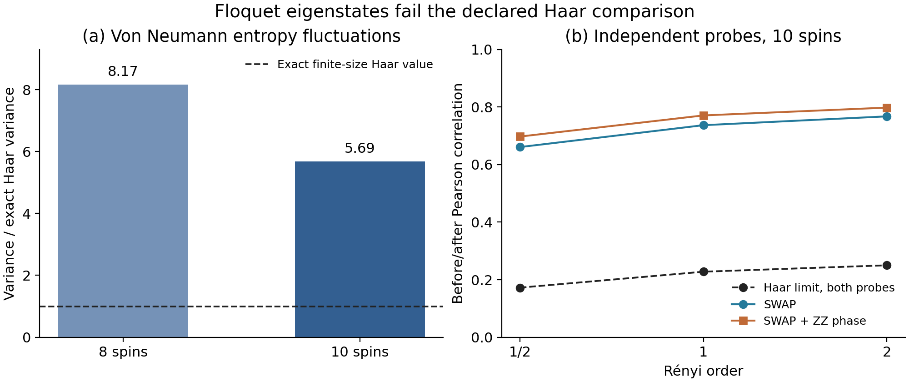

# Floquet eigenstates and the limits of the Haar benchmark

This study applies fixed boundary probes to the complete eigenbases of one nested Floquet circuit family at eight and ten spins. All twelve nontrivial gate, entropy-order, and size comparisons fail the declared combined Haar comparison band. This finite-cohort result limits the numerical reach of the [Haar theorem](../../theory/THEOREM.md); it neither contradicts that theorem nor determines the thermodynamic behavior of Floquet eigenstates.

## Model and observables

The system is an open spin chain with sizes $`N=8,10`$, balanced half dimension $`d=2^{N/2}`$, and sites $`x=-N/2,\ldots,N/2-1`$. The cut lies between sites $`-1`$ and $`0`$. A period first applies two-qubit gates on bonds with odd left coordinate, then those with even left coordinate. Every bond gate is drawn once from complex $`U(4)`$ by phase-corrected complex Gaussian QR and reused every period. Bond $`x`$ uses NumPy `SeedSequence([2026091209, x+100])`. All shared bond gates are identical across the two sizes, including the central gate in the first layer.

Complex Schur decomposition supplies the complete orthonormal eigenbasis, sorted by eigenphase: 256 states at eight spins and 1,024 at ten. These are dependent states of one nested circuit realization, with no independent circuit replication. There are no selected eigenphase windows, gate rejections, seed replacements, imposed symmetries, weak-link truncations, or spectral-tail exclusions.

Three probes act on the central qubits, independently of the circuit gates and eigenstates:

| Probe | Definition | Normalized operator Schmidt probabilities |
|---|---|---|
| Identity | $`I`$ | $`(1)`$ |
| SWAP | $`\mathrm{SWAP}`$ | $`(1/4,1/4,1/4,1/4)`$ |
| Phase-SWAP | $`\mathrm{SWAP}\exp[-i\pi(Z\otimes Z)/4]`$ | $`(1/4,1/4,1/4,1/4)`$ |

The two nontrivial probes therefore share the limiting Haar entropy prediction. They have slightly different exact Haar purity correlations at finite dimension. This experiment measures the response to these separate probes; evolution of a Floquet eigenstate through its own complete period gives only a global phase.

For Schmidt probabilities $`p_j`$, the measured entropies use natural logarithms:

```math
S_{1/2}=2\log\sum_j\sqrt{p_j},\qquad
S_1=-\sum_jp_j\log p_j,\qquad
S_2=-\log\sum_jp_j^2.
```

Purity is $`P=\sum_jp_j^2`$. Singular values supply the probabilities without removing small values; zero probabilities contribute zero to $`p_j\log p_j`$. For every probe and order, the summaries record input/output means, population variances, centered covariance, Pearson correlation, mean squared increment, and minimum Schmidt probability. Population moments divide by the full cohort count. There are 3,840 state/probe spectral records and three entropy orders per record.

## Predictions and comparison criteria

Write $`V_\alpha=\lim_{d\to\infty}d^2\mathrm{Var}_{\mathrm{Haar}}(S_\alpha)`$, let $`\rho_\alpha`$ be the limiting before/after correlation, and define $`M_\alpha=\lim_{d\to\infty}d^2\mathbb E_{\mathrm{Haar}}[(\Delta S_\alpha)^2]`$. For either nontrivial probe:

| Entropy order | Scaled variance $`V_\alpha`$ | Correlation $`\rho_\alpha`$ | Scaled squared increment $`M_\alpha`$ |
|---|---:|---:|---:|
| 1/2 | 0.125 | 0.1723221985 | 0.2069194504 |
| 1 | 0.250 | 0.2277324385 | 0.3861337807 |
| 2 | 0.500 | 0.2500000000 | 0.7500000000 |

These entropy quantities are limits at fixed active support, not exact predictions at either finite size. The [prediction code](theory/haar_predictions.py) independently evaluates the covariance series through 131,072 modes and the [reference values](theory/haar_predictions.json) also include exact finite-dimensional Haar purity moments and von Neumann mean/variance. The latter use Page's mean formula and Wei's proved variance formula. Series truncation is a numerical approximation, not a finite-size error bound. The [production predictions](results/predictions.json) were specified before evaluating eigenstate responses.

For each nontrivial probe, define the input and output variance ratios $`R_{\mathrm{in}},R_{\mathrm{out}}`$ by dividing the observed variances by $`V_\alpha/d^2`$. Define the increment ratio $`R_\Delta`$ by dividing the observed mean squared increment by $`M_\alpha/d^2`$, and the standardized mean shift by $`z_\mu=(\mu_{\mathrm{out}}-\mu_{\mathrm{in}})/\sqrt{v_{\mathrm{in}}}`$. A comparison passes only when all five conditions hold:

```math
0.75\le R_{\mathrm{in}}\le1.25,\qquad
0.75\le R_{\mathrm{out}}\le1.25,\qquad
|\rho_{\mathrm{obs}}-\rho_\alpha|\le0.10,
```

```math
0.75\le R_\Delta\le1.25,\qquad |z_\mu|\le0.25.
```

The separate equality comparison between the two nontrivial probes requires their correlations to differ by at most 0.10. These are descriptive tolerances fixed in the [original protocol](protocol.txt), not confidence levels or proved bounds on finite-size entropy bias. Identity is an exact zero-change control and is excluded from the twelve nontrivial comparisons.

## Results for every comparison

Every row below fails the combined band. The table reports the components rather than replacing them with a single pass/fail label. Full precision, covariances, marginal means, purity statistics, and individual criteria are in the [eight-spin summary](results/summary_N8.json) and [ten-spin summary](results/summary_N10.json).

| Spins | Probe | Order | Input variance ratio | Output variance ratio | Correlation | Increment ratio | Standardized mean shift |
|---|---|---:|---:|---:|---:|---:|---:|
| 8 | SWAP | 1/2 | 5.444715 | 3.216175 | 0.743883 | 1.511558 | 0.110957 |
| 8 | SWAP | 1 | 8.086196 | 4.407668 | 0.812486 | 1.882227 | 0.118964 |
| 8 | SWAP | 2 | 9.952648 | 5.311643 | 0.833044 | 2.225371 | 0.137291 |
| 8 | Phase-SWAP | 1/2 | 5.444715 | 3.736485 | 0.805898 | 1.247486 | 0.168043 |
| 8 | Phase-SWAP | 1 | 8.086196 | 4.910869 | 0.850965 | 1.629806 | 0.174108 |
| 8 | Phase-SWAP | 2 | 9.952648 | 5.464707 | 0.847074 | 2.171164 | 0.183045 |
| 10 | SWAP | 1/2 | 4.253456 | 2.350724 | 0.660755 | 1.791661 | 0.356430 |
| 10 | SWAP | 1 | 5.671329 | 3.120905 | 0.736736 | 2.116889 | 0.345354 |
| 10 | SWAP | 2 | 7.135991 | 3.881244 | 0.767407 | 2.466718 | 0.326386 |
| 10 | Phase-SWAP | 1/2 | 4.253456 | 2.598742 | 0.697243 | 1.674149 | 0.361341 |
| 10 | Phase-SWAP | 1 | 5.671329 | 3.402945 | 0.770672 | 1.928102 | 0.344994 |
| 10 | Phase-SWAP | 2 | 7.135991 | 4.113724 | 0.797838 | 2.216621 | 0.317799 |

Input variance, output variance, and correlation fail in every row. Eleven increment comparisons fail; the half-order phase-SWAP increment at eight spins passes. All mean-shift comparisons pass at eight spins and fail at ten. Identity gives zero entropy and purity increments exactly.

The discrepancy in the marginal fluctuation scale also survives comparison with exact finite-dimensional Haar values:

| Spins | Observed von Neumann mean | Exact Haar mean | Von Neumann variance / exact Haar variance | Purity variance / exact Haar variance |
|---|---:|---:|---:|---:|
| 8 | 2.191083 | 2.274866 | 8.170846 | 15.927691 |
| 10 | 2.928578 | 2.966305 | 5.686116 | 8.526377 |

At ten spins, observed purity correlations are 0.771542 for SWAP and 0.800942 for phase-SWAP, against exact Haar references 0.250737 and 0.248779. This discrepancy involves a polynomial observable with no entropy-series approximation.



The figure uses an exact finite-dimensional Haar variance in its first panel and limiting entropy correlations in its second. No independent circuit ensemble was sampled, so there are no sampling error bars. Lines across the three fixed entropy orders guide the eye.

The two nontrivial probes differ in correlation by at most 0.062016, within their separate equality band at both sizes and all orders. Thus this study does not resolve a violation of operator-Schmidt-spectrum sufficiency for independent probes, and it does not establish that sufficiency either.

Higher correlation coexists here with larger absolute entropy changes. For any finite cohort,

```math
\mathbb E[(S_{\mathrm{out}}-S_{\mathrm{in}})^2]
=v_{\mathrm{out}}+v_{\mathrm{in}}
-2\mathrm{Cov}(S_{\mathrm{out}},S_{\mathrm{in}})
+(\mu_{\mathrm{out}}-\mu_{\mathrm{in}})^2.
```

Both probes reduce the marginal variance and increase the mean, so stationarity of the transformed ensemble cannot be assumed. This identity explains the coexistence of the statistics; it supplies no microscopic mechanism for the excess variance.

## Exact obstruction for the circuit's crossing gate

The circuit's own central gate is a separate, circuit-correlated probe. In the specified starting frame, the period factorizes as

```math
F=L G_c,\qquad L=L_A\otimes L_B.
```

Only $`G_c`$ crosses the cut. The eigenstate equation therefore gives

```math
F|\psi_j\rangle=e^{i\theta_j}|\psi_j\rangle
\quad\text{implies}\quad
G_c|\psi_j\rangle=e^{i\theta_j}L^\dagger|\psi_j\rangle.
```

The entire Schmidt spectrum is unchanged, so every entropy and purity increment vanishes exactly. The corresponding correlation is one when its cohort variance is nonzero and undefined when that variance is zero. The central gate is nonproduct, with operator purity about 0.486490. Thus an unconditional extension of the Haar prediction to probes correlated with the eigenstate-generating circuit is impossible.

This argument is a consequence of stationarity and does not predict the responses to the two independent probes. It uses the input frame immediately before the sole crossing gate: another frame requires a consistent transformation of the state or probe. With multiple crossing gates per period, individual entropy increments need not vanish; periodic spatial boundaries can introduce a second crossing.

The numerical anchor uses 16 equally spaced eigenphase indices per size, separately from the three primary probes. The independent implementation finds maximum Schmidt-probability changes below $`10^{-15}`$ and entropy changes below $`2.3\times10^{-15}`$.

## Diagnostics, validation, and data access

Circular gap ratios are 0.632345 and 0.604300; scaled computational-basis inverse participation ratios are 2.096150 and 2.039228. Total Z, Z parity, total X flip, and reflection have nonzero normalized commutators with both Floquet operators. No eigenphase degeneracy is numerically unresolved. All bond operator purities are recorded, with maximum 0.520630 at both sizes. Minimum Schmidt probabilities over the primary observations are approximately $`1.90\times10^{-7}`$ and $`4.84\times10^{-9}`$.

These diagnostics describe the two selected finite operators. They do not prove thermodynamic chaos, exclude every hidden symmetry, supply independent-circuit uncertainty, or determine a limiting fluctuation law from two nested sizes. Exact Haar references remove ambiguity in the Haar benchmark while leaving finite-size effects of the Floquet ensemble itself.

The [recorded independent validation](verification/independent_audit.json) uses [separate code](verification/independent_audit.py) without importing production functions. It rebuilds the circuit with Kronecker embeddings, checks all 1,280 eigenvectors, independently evaluates entropy from reduced-density-matrix eigenvalues on 96 state/probe representatives, and recomputes every scalar summary. Maximum eigenvector residuals are below $`2.6\times10^{-14}`$, orthogonality errors below $`2.5\times10^{-14}`$, independent entropy discrepancies below $`6.3\times10^{-15}`$, and summary discrepancies below $`2.6\times10^{-12}`$.

The repository includes the summaries, predictions, figure, [calculation source](floquet_test.py), [plot source](plot_results.py), [environment pins](requirements-reproduction.txt), and numerical validation record. The complete cohort arrays, including eigenvectors, bond and probe matrices, and per-state observations, are **not included** in the checkout. Their inventory and recorded hashes are provided in [omitted_arrays.json](omitted_arrays.json). Rerunning the array-dependent validation requires regenerating those arrays; the [reproduction instructions](../../REPRODUCE.md) provide the bounded procedure.
