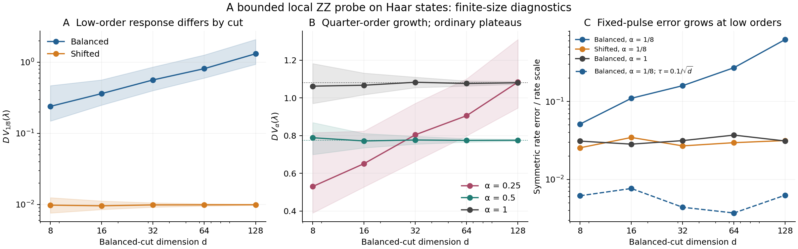
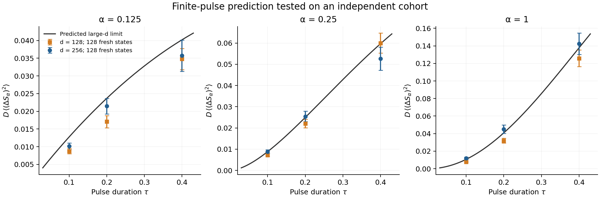
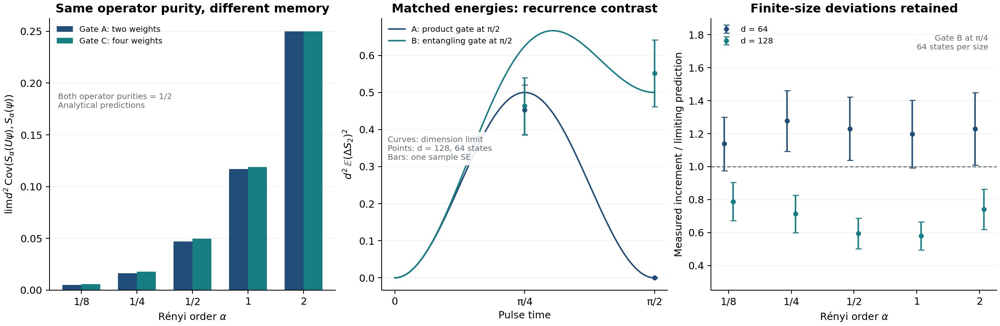

# Haar-state response and entropy memory

These three numerical studies measure how a fixed boundary gate changes the
entanglement of a complex-Haar pure state. They distinguish instantaneous
entropy response, finite-duration increments, and the effect of changing the
gate's operator Schmidt spectrum. The analytical statement and its assumptions
are in the [covariance theorem](../../theory/THEOREM.md).

All entropies use natural logarithms and the orders
$`\alpha\in\{1/8,1/4,1/2,1,2\}`$. States are normalized arrays of independent
complex Gaussian entries. Schmidt probabilities are squared singular values of
the state coefficient matrix. There are no eigenvalue cutoffs, clipped tails,
or excluded states. Write $`D=d^2`$ for the total Hilbert-space dimension and
$`\Delta S_\alpha(t)=S_\alpha(U(t)\psi)-S_\alpha(\psi)`$.

| Study | Half dimensions and independent inputs | Gate and durations | Complete numerical record |
|---|---|---|---|
| Instantaneous response | $`d=8,16,32,64,128`$; 256 states per size, each viewed at cuts $`(d,d)`$ and $`(d/2,2d)`$ | Boundary $`Z\otimes Z`$; pulse subset described below | [Response summary](numerics/results/summary.json), [arrays](numerics/results/) |
| Finite-time memory | Balanced cuts; $`d=128,256`$; 128 independent states per size | Boundary $`Z\otimes Z`$; $`t=\pm0.1,\pm0.2,\pm0.4`$ | [Finite-time summary](numerics/followup_results/summary.json), [arrays](numerics/followup_results/) |
| Matched diagonal interactions | Balanced cuts; $`d=64,128`$; 64 independent states per size | Two interactions on boundary factors of dimension four; $`t=\pi/4,\pi/2`$ | [Diagonal summary](numerics/operator_results/summary.json), [arrays](numerics/operator_results/) |

Inputs are reused within each row's comparisons, so the resulting observables
are correlated. The three cohorts use distinct seed rules and are not pooled.
The first row contains 1,280 global states, the second 256, and the third 128.

## Instantaneous response

The probe acts on the last qubit of the left subsystem and the first qubit of
the right subsystem. At fixed Schmidt probabilities $`\lambda`$, randomizing
the two Schmidt bases gives an exact conditional covariance for the entropy
rates. For subsystem dimensions $`a\leq b`$, define

```math
w_{\alpha i}=g_{\alpha i}-\sum_j\lambda_jg_{\alpha j},
\qquad
g_{\alpha i}=\frac{\alpha\lambda_i^{\alpha-1}}
{(1-\alpha)\sum_j\lambda_j^\alpha}
\quad(\alpha\ne1),
\qquad g_{1i}=-\log\lambda_i.
```

The conditional means vanish and the covariance is

```math
\mathbb E[(\partial_t S_\alpha)(\partial_t S_\beta)\mid\lambda]
=\frac{2ab}{(a^2-1)(b^2-1)}
\sum_i\lambda_iw_{\alpha i}w_{\beta i}.
```

The [conditional response derivation](../../theory/CONDITIONAL_RESPONSE.md)
establishes this identity and states its low-order moment qualifications.

The study records this full matrix and the actual physical derivative for
every state and cut. Its primary summary is the median and interquartile range
over spectra of $`D`$ times the conditional variance. Endpoint medians are:

| Cut and dimension | Order 1/8 | Order 1/4 | Order 1/2 | Order 1 | Order 2 |
|---|---:|---:|---:|---:|---:|
| Balanced, $`d=8`$ | 0.239413 | 0.530198 | 0.788723 | 1.062073 | 1.775860 |
| Balanced, $`d=128`$ | 1.314989 | 1.083778 | 0.775419 | 1.080289 | 1.997555 |
| Shifted, $`d=8`$ | 0.009778 | 0.036967 | 0.130680 | 0.418959 | 1.108252 |
| Shifted, $`d=128`$ | 0.009914 | 0.037671 | 0.135804 | 0.447406 | 1.279968 |

The balanced low-order response grows on this rescaled axis, while the shifted
cut and the ordinary balanced orders approach plateaus. Five sizes do not
establish asymptotic exponents. Changing the cut changes both the aspect ratio
and the physical boundary bond; these observations do not establish spatial
protection of a given state's entanglement.

The first 64 states at each size also receive exact pulses
$`U(t)=\cos(t)I-i\sin(t)Z\otimes Z`$, at both signs of
$`t\in\{0.02,0.1,0.1/\sqrt d,0.5/\sqrt d\}`$. The stored comparison of the
symmetric secant with the initial rate diagnoses the failure of a uniform
linear-response approximation at the tested durations. It is not a proof of
a shrinking-time scaling law. Across random balanced spectra, fourth moments
of rates can fail for $`\alpha\leq1/4`$; ordinary variance-based error bars for
the mean squared rate are therefore inappropriate.

Two additional tests hold one spectrum fixed at each of $`(a,b)=(8,8)`$ and
$`(4,16)`$, then draw 4,000 pairs of Haar Schmidt bases. Their largest
second-moment discrepancies are 1.733 and 1.068 conditional sample standard
errors. Central finite differences on one state per size and both cuts have
maximum absolute derivative error $`1.96\times10^{-10}`$ at step
$`10^{-5}`$. Full results, including the other step sizes, are in
[validation.json](numerics/results/validation.json); an independent
commutator and matrix-exponential calculation is recorded in
[independent response checks](numerics/audit05.json).



## Finite-time memory

This independent cohort tests fixed positive durations against the limiting
covariance series. Its per-state statistic averages the two pulse signs:

```math
Y_\alpha(t)=\frac{D}{2}
\left[(\Delta S_\alpha(t))^2+(\Delta S_\alpha(-t))^2\right].
```

The estimate is the mean of 128 values of $`Y_\alpha(t)`$, and the sample
standard error is their sample standard deviation divided by $`\sqrt{128}`$.
The two signs are not counted as independent inputs. Predictions use the
operator probabilities $`(\cos^2t,\sin^2t)`$ and the coefficients in the
[theorem](../../theory/THEOREM.md), without fitted parameters.

At the shortest tested duration, $`t=0.1`$:

| Order | Limiting prediction | $`d=128`$: mean ± sample SE | $`d=256`$: mean ± sample SE |
|---|---:|---:|---:|
| 1/8 | 0.012747 | 0.008752 ± 0.000743 | 0.010139 ± 0.000897 |
| 1/4 | 0.008829 | 0.007203 ± 0.000598 | 0.008811 ± 0.000854 |
| 1/2 | 0.007461 | 0.005549 ± 0.000550 | 0.008044 ± 0.000871 |
| 1 | 0.010647 | 0.007825 ± 0.000799 | 0.011968 ± 0.001415 |
| 2 | 0.019735 | 0.015245 ± 0.001559 | 0.024468 ± 0.002752 |

The smaller cohort dimension shows visible deviations, especially at low
order. Increasing the dimension improves some comparisons but does not remove
all discrepancies. The [full summary](numerics/followup_results/summary.json)
contains all three durations and both dimensions. Sample errors do not include
finite-size bias, and comparisons sharing a state are correlated. These data
do not determine a convergence rate or establish a temporal exponent.

The [prediction record](numerics/followup_results/frozen_prediction.json)
contains the saved parameter values, source hashes, and series-cutoff
diagnostic. The difference after doubling the cutoff is
$`3.84\times10^{-15}`$; this is a numerical stability diagnostic, not a
rigorous remainder bound.



## Matched diagonal interactions

Each Hamiltonian is diagonal on two boundary qubits in each half. Its 16
energies are the entries of the following matrices:

```math
h_A=(1,-1,1,-1)^{\mathrm T}(1,1,-1,-1),
\qquad
h_B=\begin{pmatrix}
1&1&-1&-1\\
1&-1&-1&1\\
-1&-1&1&1\\
-1&1&1&-1
\end{pmatrix}.
```

Both have eight energies of each sign, norm one, zero row and column means,
and mean squared interaction strength one. Nevertheless their gates have
different operator probabilities:

```math
\eta^A(t)=(\cos^2t,\sin^2t),\qquad
\eta^B(t)=(\cos^2t,\tfrac12\sin^2t,\tfrac12\sin^2t).
```

Each of the 64 states per size is used for both interactions and both times.
The measured statistic is $`D(\Delta S_\alpha)^2`$. Individual and paired
differences use sample standard errors over the 64 independent inputs.

At $`t=\pi/2`$, gate A is a product unitary and its increment is exactly zero;
the maximum recorded entropy recurrence error is
$`1.78\times10^{-15}`$. For gate B at $`d=128`$, the measured order-two
increment statistic is 0.551942 ± 0.090132, compared with the limiting value
0.5. The finite-size comparison at $`t=\pi/4`$ is less favorable:

| Gate B, $`d=128`$, $`t=\pi/4`$ | Measured mean | Sample SE | Limiting prediction |
|---|---:|---:|---:|
| Order 1/2 | 0.107929 | 0.016960 | 0.181407 |
| Order 1 | 0.188963 | 0.027740 | 0.326083 |
| Order 2 | 0.463344 | 0.076495 | 0.625000 |

Several paired B-minus-A estimates at this point are negative, although their
limiting predictions are positive. The corresponding B estimates at
$`d=64`$ lie above the predictions. Finite-size bias and sampling effects are
not separated by these two sizes. Ratios of deviations to estimated sample
errors of squared increments are not calibrated Gaussian significance scores.
The recurrence contrast is clearer than quantitative convergence of the full
kernel in this cohort. All individual and paired values remain in the
[diagonal summary](numerics/operator_results/summary.json).



The separate [equal-purity calculation](numerics/operator_results/equal_purity_analytic.json)
compares gates A and C through analytical series. It contains no random-state
samples and should not be counted as another numerical cohort.

## Data layout and reproducibility

The random-state generators use NumPy `default_rng` with the following
`SeedSequence` inputs. Sample indices start at zero.

| Cohort | Seed rule | Stored state-level arrays |
|---|---|---|
| Response | `[90512026, d, sample]`, 256 samples | `spectra`, `rates`, `covariance`, `trace_errors`; `changes` has axes `(64 states, 4 durations, 2 signs, 5 orders)` |
| Fixed-spectrum orientation tests | One generator seeded `90512999`, following the order in `validate` | `spectrum`, `rates`, `predicted`, `empirical`, `se`, `z` |
| Finite-time memory | `[90512506, d, sample]`, 128 samples | `spectra`, `initial_entropies`; `changes` has axes `(128 states, 3 durations, 2 signs, 5 orders)` |
| Diagonal interactions | `[90612026, d, sample]`, 64 samples | `spectra`, `HA`, `HB`; `changes` has axes `(64 states, 2 gates, 2 times, 5 orders)` |

For the two signed-pulse arrays, signs are ordered positive then negative.
The diagonal gate axis is A then B. The response files are named
`haar_d{d}_balanced.npz` and `haar_d{d}_shifted.npz`; `anchor_d{d}.npz` stores
the actual first state at each size. The two other cohorts are stored as
[fresh_d128.npz](numerics/followup_results/fresh_d128.npz),
[fresh_d256.npz](numerics/followup_results/fresh_d256.npz),
[matched_d64.npz](numerics/operator_results/matched_d64.npz), and
[matched_d128.npz](numerics/operator_results/matched_d128.npz).

Exact implementations are [run_experiment.py](numerics/run_experiment.py),
[finite_time_followup.py](numerics/finite_time_followup.py), and
[operator_memory.py](numerics/operator_memory.py). The complete raw protocols
are [response](protocol.txt), [finite time](finite_time_protocol.txt), and
[diagonal interactions](diagonal_protocol.txt). The source and protocol hashes
are retained in [response metadata](numerics/results/provenance.json), the
[finite-time prediction record](numerics/followup_results/frozen_prediction.json),
and the [diagonal prediction record](numerics/operator_results/frozen_prediction.json).
Use the repository's [reproduction instructions](../../REPRODUCE.md) for
deterministic checks, summary and figure regeneration, or optional full
regeneration of these fixed cohorts.
